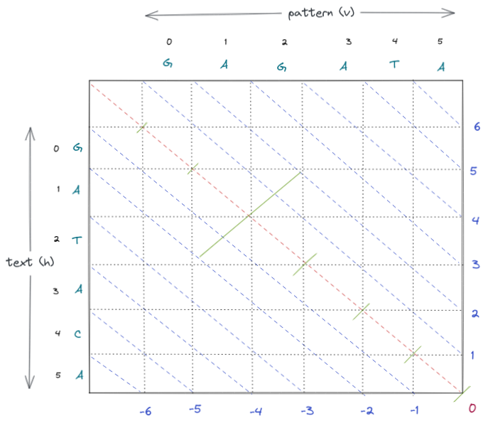
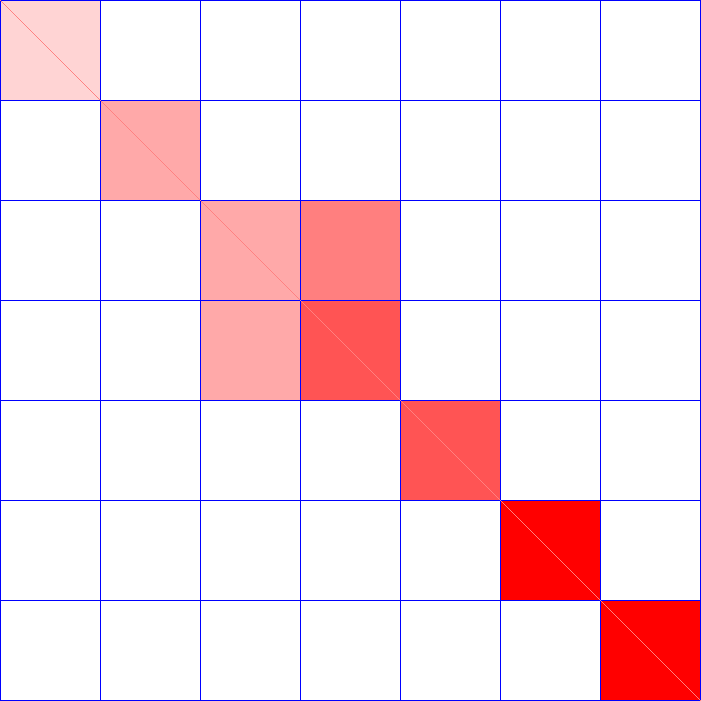

# WFA and wfλ
## WFA

Wavefront expansion global alignment algorithm.



Takes two parameters `text` and `pattern` of length `tlen` and `qlen` respectively.

It then cuts across 3 DP tables (I, D and M, as in Smith, Waterman and Gotoh)
using negative gradient diagonal lines as in (Myers ... and Marco 2020).

The central diagonal (`A_k`) is computed `A_k := tlen - qlen`.
When `tlen === qlen`, `A_k === 0` and runs from the top left cell to the bottom
right cell.
Diagonals below the central diagonal are negative diagonals and diagonals above
it are positive diagonals.

The aim of the alignment algorithm is to move along the `A_k` from the top left
cell `(0,0)` to the bottom right cell `(tlen, qlen)`.

The movement is made in steps called offsets.
An `offset` is the number of steps made along a diagonal starting from the
start of the diagonal.

`(v,h)` is a cell in the matrix.

```
v = offset - k
h = offset
A_k = (tlen-qlen) The central diagonal
```




## wfλ

Rust implementation of [ekg/wflambda](https://github.com/ekg/wflambda).

A generalization of the wavefront alignment (WFA) algorithm
that lets us to run WFA on regions and not only perform base level alignment.

### Citation

**Santiago Marco-Sola, Juan Carlos Moure, Miquel Moreto, Antonio Espinosa**. ["Fast gap-affine pairwise alignment using the wavefront algorithm."](https://doi.org/10.1093/bioinformatics/btaa777) Bioinformatics, 2020.
