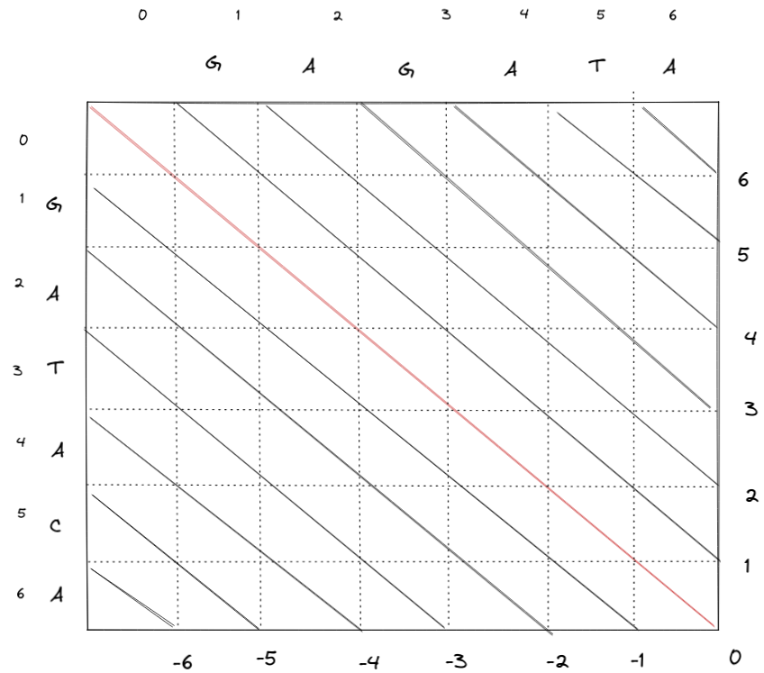

# WFA

Wavefront expansion global alignment algorithm.

Takes two parameters `text` and `pattern` of length `tlen` and `qlen`
respectively.



We cut across 3 DP tables (I, D and M, as in Smith, Waterman and Gotoh) using
negative gradient diagonal lines as in (Myers ... and Marco 2020).

The central diagonal (`A_k`) is computed `A_k := tlen - qlen`.
It is `0` and runs from the top left cell to the bottom right cell when
`tlen === qlen`.
Diagonals below the central diagonal are negative diagonals and diagonals above
it are positive diagonals.

The aim of the alignment algorithm is to move along the `A_k` from the top left
cell `(0,0)` to the bottom right cell `(tlen, qlen)`.

The movement is made in steps called offsets.
An `offset` is the number of steps made along a diagonal starting from the
start of the diagonal.

`(v,h)` is a cell in the matrix.

```
v = offset - k
h = offset
A_k = (tlen-qlen) The central diagonal
```


```
                        pattern
                <--------- h --------->
       |---|---|---|---|---|---|---|---|
       |   |   | 0 | 1 | 2 | 3 | 4 | 5 |
       |---|---|---|---|---|---|---|---|
       |   |   | G | A | G | A | T | A |
       |---|---|---|---|---|---|---|---|
   ^   | 0 | G |   |   |   |   |   |   |
   |   |---|---|---|---|---|---|---|---|
 t |   | 1 | A |   |   |   |   |   |   |
 e |   |---|---|---|---|---|---|---|---|
 x V   | 2 | T |   |   |   |   |   |   |
 t |   |---|---|---|---|---|---|---|---|
   |   | 3 | A |   |   |   |   |   |   |
   |   |---|---|---|---|---|---|---|---|
   |   | 4 | C |   |   |   |   |   |   |
   |   |---|---|---|---|---|---|---|---|
   v   | 5 | A |   |   |   |   |   |   |
       |---|---|---|---|---|---|---|---|
```


### Citation

**Santiago Marco-Sola, Juan Carlos Moure, Miquel Moreto, Antonio Espinosa**. ["Fast gap-affine pairwise alignment using the wavefront algorithm."](https://doi.org/10.1093/bioinformatics/btaa777) Bioinformatics, 2020.
